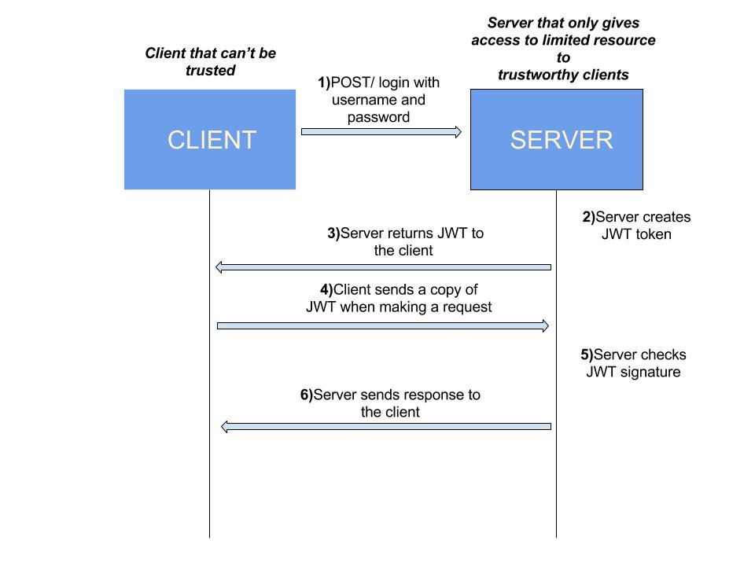

# JWT #

JWT Stands for Json Web Token and it is open source standard for RFC7519, 
JWT is only used for authorization. 
In authentication we usually take username and password and validate to grant access wheather 
in authorization we grant access that user for particullar assets.

## Session Based Login ##

## JWT Based Login ##

### JWT consist of ? ###
JWT consist for three things
* Header
* Payload
* Signiture

Header: The header typically consists of two parts, The Type which is JWT and the signing algorithem.  
Payload: The Second part of JWT is payload which contains the claims, 
Claims are statement about an entity and additional data.  
 

### There are three type of claims ###
* Registered
* Public
* Private

#### Registered claims: ####
Registered claims These are a set of predefined claims which are not mandatory but recommended
registered clains types are iss(issue), exp(expiration time ), sub(subject), aud(audience)
#### Public claims: ####
Public claims These can be defined at will by those using JWTs.
But to avoid collisions they should be defined in the IANA JSON Web Token 
Registry or be defined as a URI that contains a collision resistant namespace.
#### Private claims: ####
Private claims These are the custom claims created to share information between parties 
that agree on using them and are neither registered or public claims.

### JWT Valid for ? ###
JWT valid for limited time period and its expiration data can be get from exp(expiration time)

### Why we used JWT ? ###
* JWT provide good performance because it's contains all valid information for authorization and don't go
to the server again and again to validate user informaion.
* Allow multiple backend access with single token
* Its is very friendly because cookies are not used.
* Its digitaly signed and if any one changed it then it easily identified on server.

